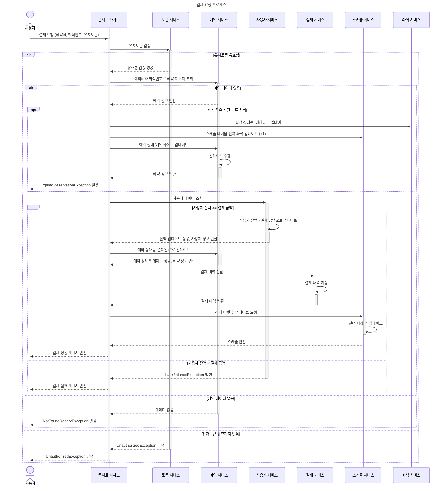

```mermaid
---
config:
  theme: default
---
sequenceDiagram
    title 결제 요청 프로세스
    actor 사용자 as 사용자
    participant ConsertFacade as 콘서트 파사드
    participant TokenService as 토큰 서비스
    participant ReservationService as 예약 서비스
    participant UserService as 사용자 서비스
    participant PaymentService as 결제 서비스
    participant ScheduleService as 스케줄 서비스
    participant SeatService as 좌석 서비스

    사용자->>+ConsertFacade: 결제 요청 (예약Id, 좌석번호, 유저토큰)
    ConsertFacade->>+TokenService: 유저토큰 검증
    alt 유저토큰 유효함
        TokenService-->>ConsertFacade: 유효성 검증 성공
        ConsertFacade->>+ReservationService: 예약Id와 좌석번호로 예약 데이터 조회
        alt 예약 데이터 있음
            ReservationService-->>ConsertFacade: 예약 정보 반환
            opt 좌석 점유 시간 만료 처리
                ConsertFacade->>+SeatService: 좌석 상태를 '비점유'로 업데이트    
                ConsertFacade->>+ScheduleService: 스케줄 테이블 잔여 좌석 업데이트 (+1)
                ConsertFacade->>ReservationService: 예약 상태 '예약취소'로 업데이트
                ReservationService->>+ReservationService: 업데이트 수행
                ReservationService-->>-ConsertFacade: 예약 정보 반환
                ConsertFacade-->>사용자: ExpiredReservationException 발생
            end
            ConsertFacade->>+UserService: 사용자 데이터 조회
            alt 사용자 잔액 >= 결제 금액
                UserService->>+UserService: 사용자 잔액 - 결제 금액으로 업데이트
                UserService-->>-ConsertFacade: 잔액 업데이트 성공, 사용자 정보 반환
                ConsertFacade->>+ReservationService: 예약 상태를 '결제완료'로 업데이트
                ReservationService-->>-ConsertFacade: 예약 상태 업데이트 성공, 예약 정보 반환
                ConsertFacade->>+PaymentService: 결제 내역 전달
                PaymentService->>+PaymentService : 결제 내역 저장
                PaymentService-->>-ConsertFacade: 결제 내역 반환
                ConsertFacade->>+ScheduleService: 잔여 티켓 수 업데이트 요청
                ScheduleService->>-ScheduleService : 잔여 티켓 수 업데이트
                ScheduleService-->>ConsertFacade: 스케줄 반환
                ConsertFacade-->>사용자: 결제 성공 메시지 반환
            else 사용자 잔액 < 결제 금액
                UserService-->>-ConsertFacade: LackBalanceException 발생
                ConsertFacade-->>사용자: 결제 실패 메시지 반환
            end
        else 예약 데이터 없음
            ReservationService-->>-ConsertFacade: 데이터 없음
            ConsertFacade-->>사용자: NotFoundReservException 발생
        end
    else 유저토큰 유효하지 않음
        TokenService-->>-ConsertFacade: UnauthorizedException 발생
        ConsertFacade-->>-사용자: UnauthorizedException 발생
    end
```
