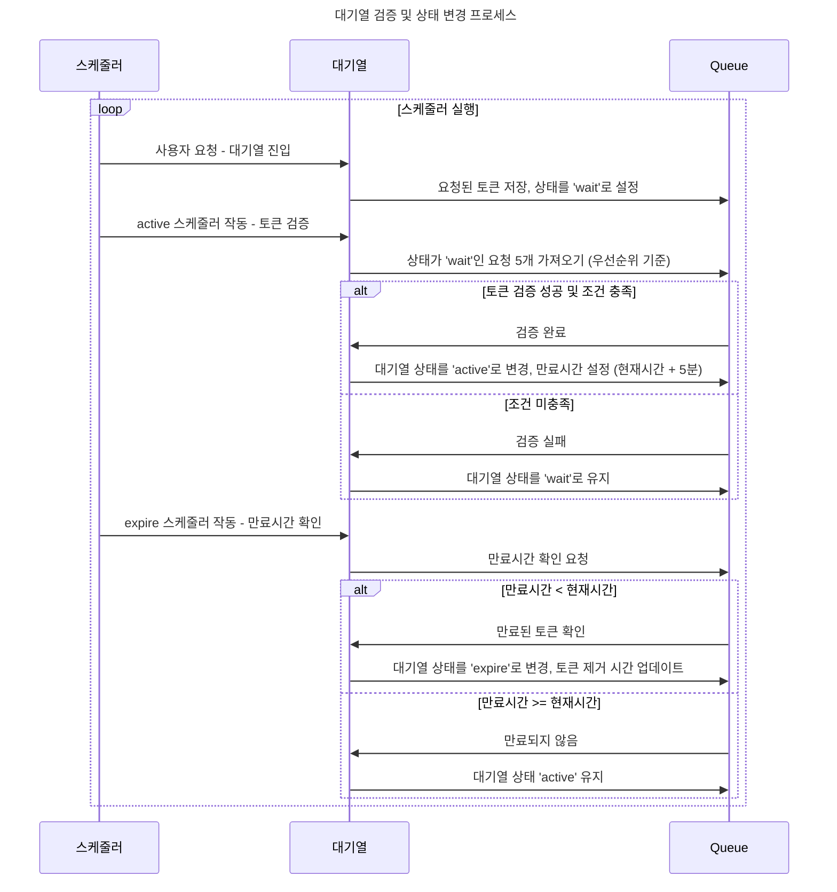

```mermaid
---
config:
  theme: default
---
sequenceDiagram
    title 대기열 검증 및 상태 변경 프로세스
    participant 스케줄러 as 스케줄러
    participant 대기열 as 대기열
    participant 큐 as Queue

    loop 스케줄러 실행
        스케줄러->>대기열: 사용자 요청 - 대기열 진입
        대기열->>큐: 요청된 토큰 저장, 상태를 'wait'로 설정

        스케줄러->>대기열: active 스케줄러 작동 - 토큰 검증
        대기열->>큐: 상태가 'wait'인 요청 5개 가져오기 (우선순위 기준)
        alt 토큰 검증 성공 및 조건 충족
            큐->>대기열: 검증 완료
            대기열->>큐: 대기열 상태를 'active'로 변경, 만료시간 설정 (현재시간 + 5분)
        else 조건 미충족
            큐->>대기열: 검증 실패
            대기열->>큐: 대기열 상태를 'wait'로 유지
        end

        스케줄러->>대기열: expire 스케줄러 작동 - 만료시간 확인
        대기열->>큐: 만료시간 확인 요청
        alt 만료시간 < 현재시간
            큐->>대기열: 만료된 토큰 확인
            대기열->>큐: 대기열 상태를 'expire'로 변경, 토큰 제거 시간 업데이트
        else 만료시간 >= 현재시간
            큐->>대기열: 만료되지 않음
            대기열->>큐: 대기열 상태 'active' 유지
        end
    end
```
