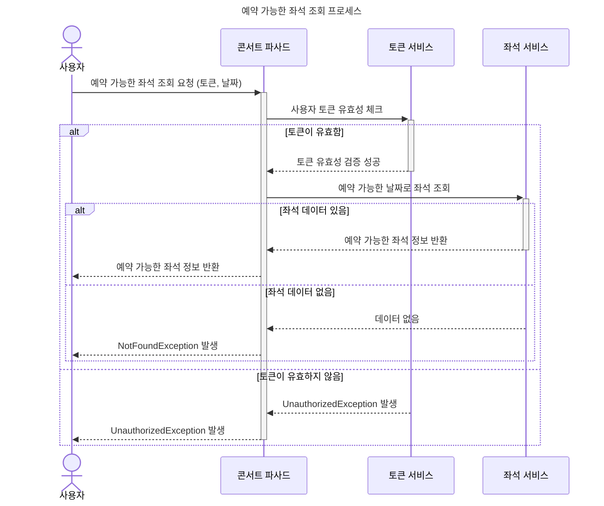

```mermaid
---
config:
  theme: default
---
sequenceDiagram
    title 예약 가능한 좌석 조회 프로세스
    actor 사용자 as 사용자
    participant ConsertFacade as 콘서트 파사드
    participant TokenService as 토큰 서비스
    participant SeatService as 좌석 서비스

    사용자->>+ConsertFacade: 예약 가능한 좌석 조회 요청 (토큰, 날짜)
    ConsertFacade->>+TokenService: 사용자 토큰 유효성 체크
    alt 토큰이 유효함
        TokenService-->>-ConsertFacade: 토큰 유효성 검증 성공
        ConsertFacade->>+SeatService: 예약 가능한 날짜로 좌석 조회
        alt 좌석 데이터 있음
            SeatService-->>-ConsertFacade: 예약 가능한 좌석 정보 반환
            ConsertFacade-->>사용자: 예약 가능한 좌석 정보 반환
        else 좌석 데이터 없음
            SeatService-->>ConsertFacade: 데이터 없음
            ConsertFacade-->>사용자: NotFoundException 발생
        end
    else 토큰이 유효하지 않음
        TokenService-->>ConsertFacade: UnauthorizedException 발생
        ConsertFacade-->>-사용자: UnauthorizedException 발생
    end
```
