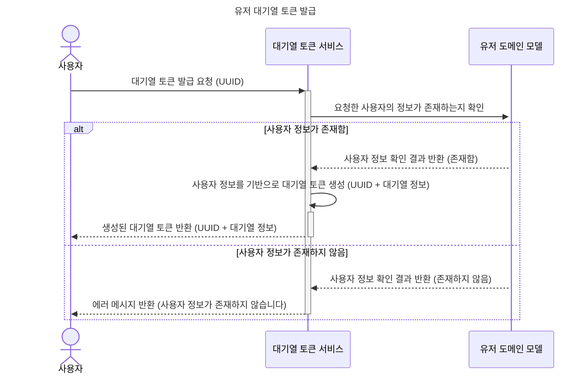

```mermaid
---
config:
  theme: default
---
sequenceDiagram
    title 유저 대기열 토큰 발급
    actor 사용자 as 사용자
    participant 서비스 as 대기열 토큰 서비스
    participant 유저도메인모델 as 유저 도메인 모델

    사용자->>+서비스: 대기열 토큰 발급 요청 (UUID)
    서비스->>+유저도메인모델: 요청한 사용자의 정보가 존재하는지 확인
    alt 사용자 정보가 존재함
        유저도메인모델-->>서비스: 사용자 정보 확인 결과 반환 (존재함)
        서비스->>+서비스: 사용자 정보를 기반으로 대기열 토큰 생성 (UUID + 대기열 정보)
        서비스-->>-사용자: 생성된 대기열 토큰 반환 (UUID + 대기열 정보)
    else 사용자 정보가 존재하지 않음
        유저도메인모델-->>서비스: 사용자 정보 확인 결과 반환 (존재하지 않음)
        서비스-->>-사용자: 에러 메시지 반환 (사용자 정보가 존재하지 않습니다)
    end
```
