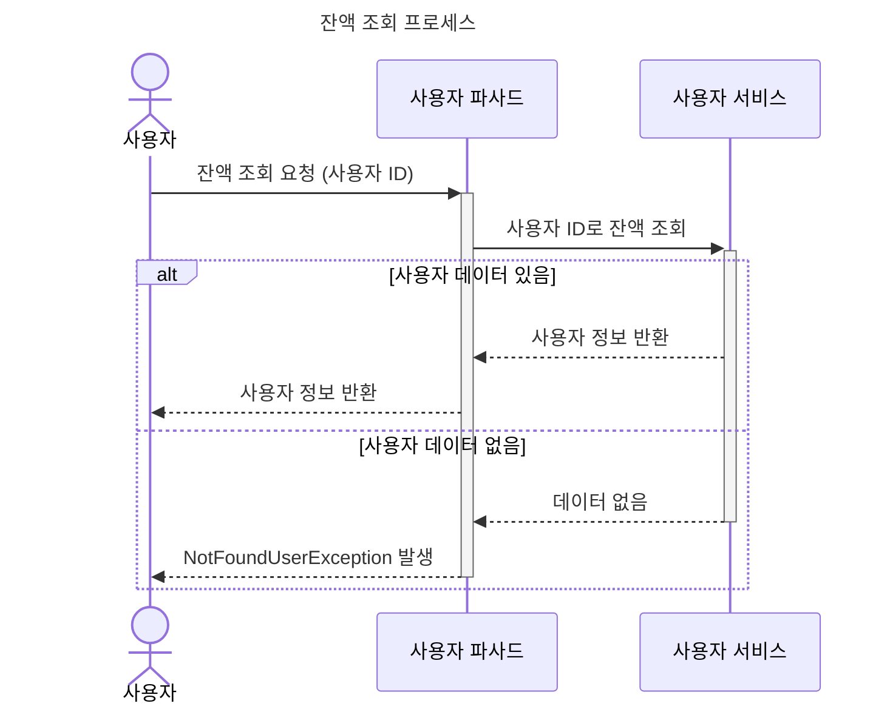

```mermaid
---
config:
  theme: default
---
sequenceDiagram
    title 잔액 조회 프로세스
    actor 사용자 as 사용자
    participant UserFacade as 사용자 파사드
    participant UserService as 사용자 서비스

    사용자->>+UserFacade: 잔액 조회 요청 (사용자 ID)
    UserFacade->>+UserService: 사용자 ID로 잔액 조회
    alt 사용자 데이터 있음
        UserService-->>UserFacade: 사용자 정보 반환
        UserFacade-->>사용자: 사용자 정보 반환
    else 사용자 데이터 없음
        UserService-->>-UserFacade: 데이터 없음
        UserFacade-->>-사용자: NotFoundUserException 발생
    end
```
