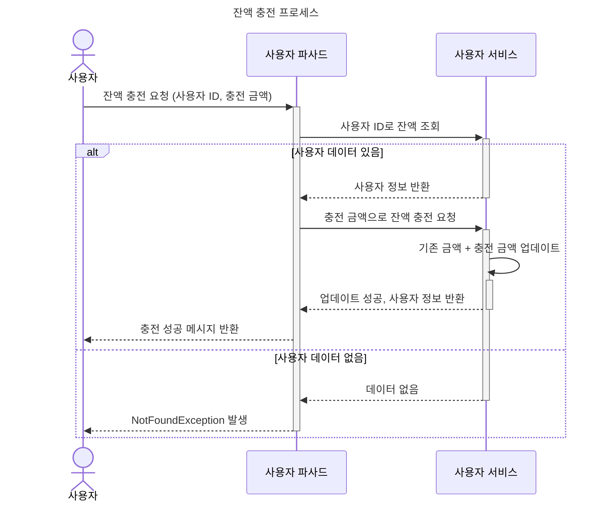

```mermaid
---
config:
  theme: default
---
sequenceDiagram
    title 잔액  충전 프로세스
    actor 사용자 as 사용자
    participant UserFacade as 사용자 파사드
    participant UserService as 사용자 서비스

    사용자->>+UserFacade: 잔액 충전 요청 (사용자 ID, 충전 금액)
    UserFacade->>+UserService: 사용자 ID로 잔액 조회
    alt 사용자 데이터 있음
        UserService-->>-UserFacade: 사용자 정보 반환
        UserFacade->>+UserService: 충전 금액으로 잔액 충전 요청
        UserService->>+UserService: 기존 금액 + 충전 금액 업데이트
        UserService-->>-UserFacade: 업데이트 성공, 사용자 정보 반환
        UserFacade-->>사용자: 충전 성공 메시지 반환
    else 사용자 데이터 없음
        UserService-->>-UserFacade: 데이터 없음
        UserFacade-->>-사용자: NotFoundException 발생
    end
```
