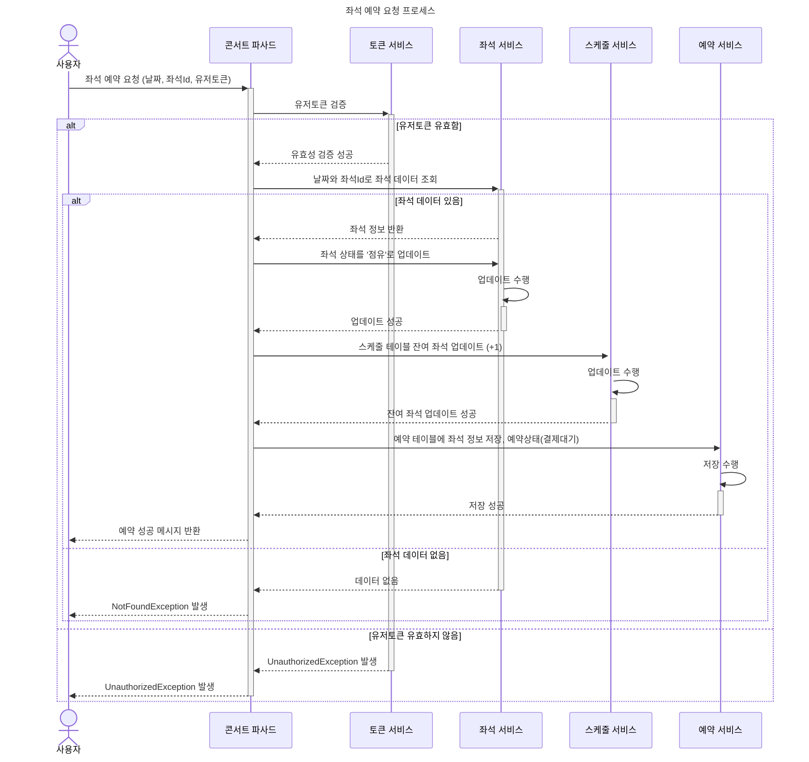

```mermaid
---
config:
  theme: default
---
sequenceDiagram
    title 좌석 예약 요청 프로세스
    actor 사용자 as 사용자
    participant ConsertFacade as 콘서트 파사드
    participant TokenService as 토큰 서비스
    participant SeatService as 좌석 서비스
    participant ScheduleService as 스케줄 서비스
    participant ReservationService as 예약 서비스

    사용자->>+ConsertFacade: 좌석 예약 요청 (날짜, 좌석Id, 유저토큰)
    ConsertFacade->>+TokenService: 유저토큰 검증
    alt 유저토큰 유효함
        TokenService-->>ConsertFacade: 유효성 검증 성공
        ConsertFacade->>+SeatService: 날짜와 좌석Id로 좌석 데이터 조회
        alt 좌석 데이터 있음
            SeatService-->>ConsertFacade: 좌석 정보 반환
            ConsertFacade->>SeatService: 좌석 상태를 '점유'로 업데이트
            SeatService->>+SeatService: 업데이트 수행
            SeatService-->>-ConsertFacade: 업데이트 성공
            ConsertFacade->>+ScheduleService: 스케줄 테이블 잔여 좌석 업데이트 (+1)
            ScheduleService->>+ScheduleService: 업데이트 수행
            ScheduleService-->>-ConsertFacade: 잔여 좌석 업데이트 성공
            ConsertFacade->>ReservationService: 예약 테이블에 좌석 정보 저장, 예약상태(결제대기)
            ReservationService->>+ReservationService: 저장 수행
            ReservationService-->>-ConsertFacade: 저장 성공
            ConsertFacade-->>사용자: 예약 성공 메시지 반환
        else 좌석 데이터 없음
            SeatService-->>-ConsertFacade: 데이터 없음
            ConsertFacade-->>사용자: NotFoundException 발생
        end
    else 유저토큰 유효하지 않음
        TokenService-->>-ConsertFacade: UnauthorizedException 발생
        ConsertFacade-->>-사용자: UnauthorizedException 발생
    end
```
